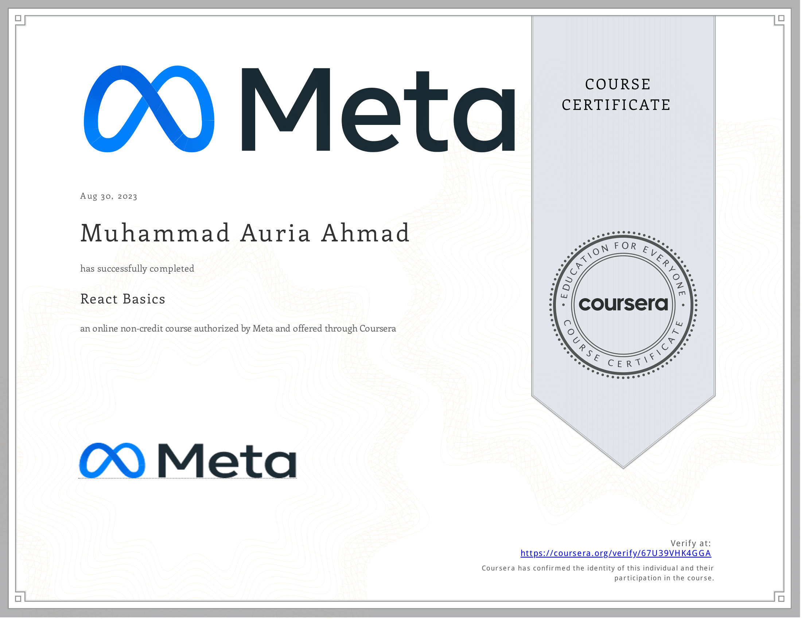

# Exploring React Front End 🚀
[Verify](https://coursera.org/share/b5a6aaf509f3bd4e117990c5d0915711)

## About
Completed the React Front End course from Coursera, offered by Meta. 📚

## Key Learnings
- **Component Architecture:** Grasped the core ideas behind React and how components work together.
- **Props and Components:** Created purposeful components, managed props, and manipulated visuals.
- **Styling and Assets:** Applied styling with assets, managed images, audio, and video.
- **State Management:** Understood state, state change, and common methods for managing it.
- **Data Flow:** Explored data flow in stateful and stateless components.
- **Event Handling:** Dynamically changed content using events, handling common errors.
- **Navigation Design:** Implemented single and multi-page navigation with routes and navbars.
- **Final Project:** Showcased skills by Building a Fully Functional Calculator in which all learnt concepts are applied.

## Onward Journey
Excited to keep building and growing with React! Looking forward to the next learning steps.

## Let's Connect! 👋
Keen to chat about React or the journey ahead? Connect on LinkedIn!

[Connect on LinkedIn](https://www.linkedin.com/in/muhammad-auria-ahmad)
